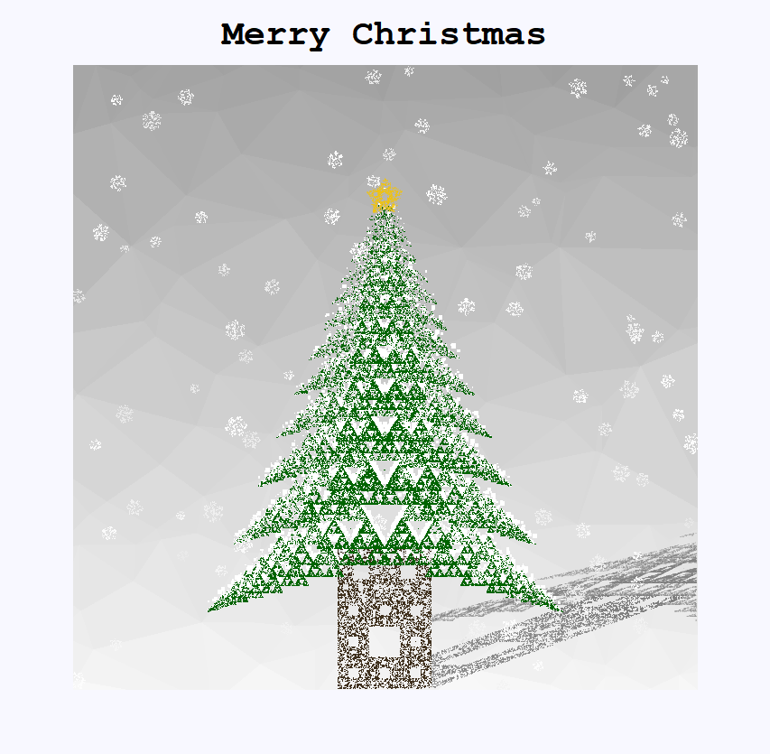
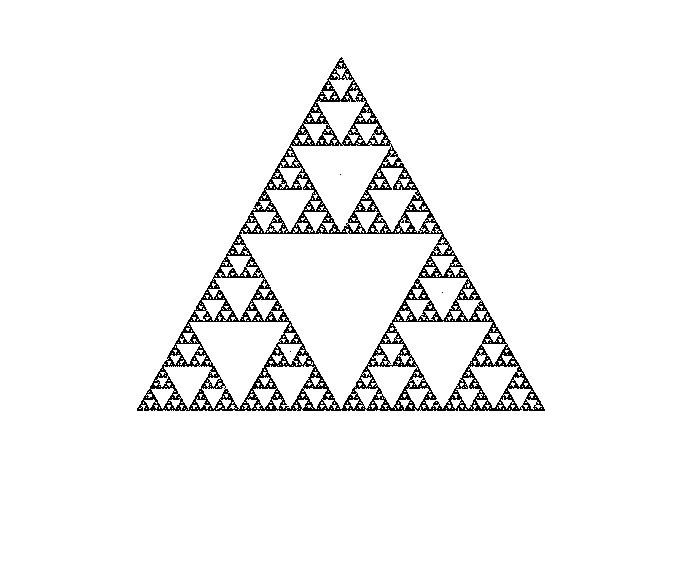
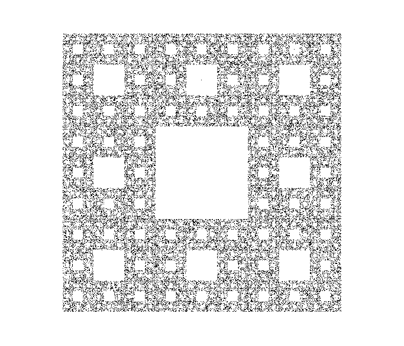
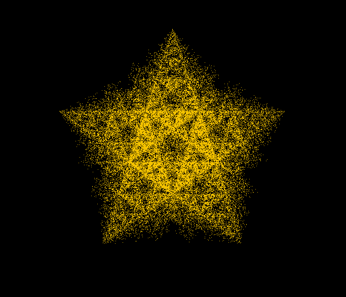
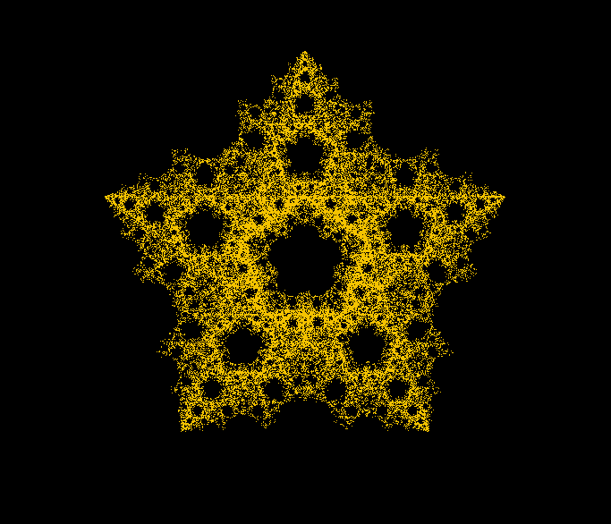
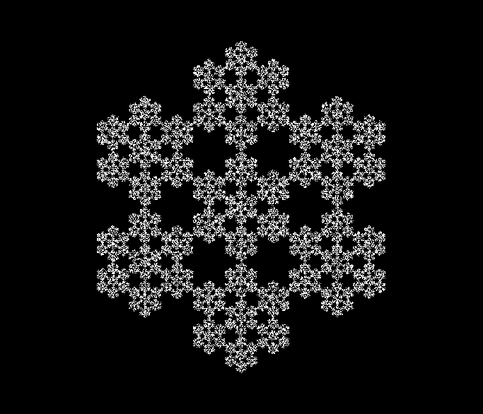
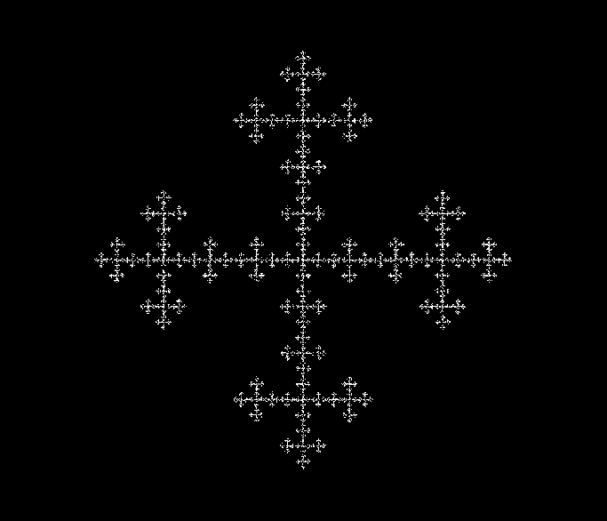

# Fractal christmas tree

## Idea

I'm inspired of [this image](https://www.codeproject.com/Articles/3412/Create-a-Fractal-Christmas-Tree). 
I used recursion, but didn't refer to the detailed implementation.   
Also, [3D fractal tree iamge](https://think-maths.co.uk/festive-fractal-trees) is referenced.

## common.R

common.R includes several funcitons to draw a fractal christmas tree.

`background()` function draws the background. We get x and y coordinates randomly from `runif()` and select groups of points using Delaunay Triangulation. 
To implement Delaunay Triangulation, `interp` package is used.   

`move()` function is the key function in this code. Snow, star, tree leaves, tree trunk are consisting of fractal shapes. I use chaos game algorithm to draw these parts. See   
[Chaos game](https://en.wikipedia.org/wiki/Chaos_game)   
[The Chaos Game: an experiment about fractals, recursivity and creative coding](https://www.r-bloggers.com/2019/10/the-chaos-game-an-experiment-about-fractals-recursivity-and-creative-coding/)   

`triangle_snow()` is a variant of the existing algorithm. 
I partially colored sierpinski triangle differently using previous selected point and current selected point. Using this trick, I made the tree snowy.
There are two parameters `p` and `q` for controlling the degree of snow. Also, I drew a white tree before drawing a green tree.   

`tree()` is the most important function. It draws tree leaves using recursion. 
There is a global variable (matrix) `treexycol` to store x, y coordinate and color. 
Because R is slow for binding rows, it takes some time. This can be improved using C++ like `Rcpp`. 
This function behaves differently depending on the direction. 
It takes the coordinates of the center of gravity, the radius of the circumcircle, the number of points and the depth as its argument.
It newly calculates the coordinates and then recursively call itself.
The number of points `N` was determined in proportion to the area of the triangle to maintain the density.   

`map()` is for shading. Shade is added by mapping coordinate. (shearing and scaling)   

## main.R

Based on common.R, I draw fractal tree in main.R   

## test.R

This includes several test codes.   

